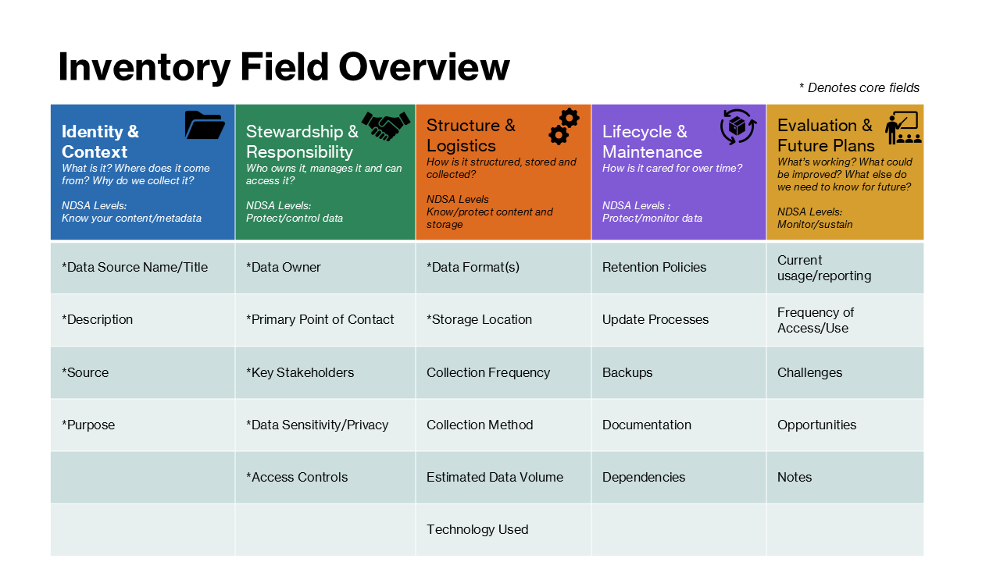

# Data Inventory Template

This repository contains a **blank data inventory template** designed to help digital preservation teams document and assess their organizational data sources.  

The template is flexible and iterative, so you can start with core fields and expand as needed. It is also a work in progress, so fields and structure may be updated over time based on team needs and feedback.

The goal is to increase trust, reduce risk, and make knowledge about data sources visible and actionable.

---

## Why a Data Inventory?

Organizations often interact with more data sources than they realize, including:  
- Systems and dashboards  
- Documentation and training resources  
- Collaborative notes and ticketing threads  
- Program or workflow statistics  

Without documentation, these sources may be forgotten, duplicated, or become inaccessible. A data inventory helps:  
- Support onboarding of new staff  
- Identify gaps and opportunities for better use of data  
- Reduce risk of “invisible” or lost data  
- Build trust and encourage collaboration  

---

## Repository Contents

- `data_inventory_template.xlsx` – Excel workbook with:  
  - **Instructions**
  - **Field Explanations** (detailed descriptions of each column)  
  - **Data_Inventory_Template** (blank template for use)  

  Appendices can be included as additional tabs when needed to note future data needs or excluded sources.

---

## Instructions

**Purpose:**  
This is a blank template for documenting and assessing organizational data sources.  

**Frequency:**  
Complete the inventory every 1–2 years, or whenever new data sources are added.  

**Starting a New Inventory:**  
- Make a new copy of the `Data_Inventory_Template` tab (or duplicate the entire workbook if preferred).  
- Rename the worksheet to reflect the date or project (e.g., `UNIT_Data_Source_Inventory_2025-10-01`).  

**Filling It Out:**  
- Complete the inventory fields for each data source.  
- Refer to the **Field Explanations** tab (second tab) for definitions and guidance.  

**Adding New Fields:**  
- If you need to track information not covered by the existing columns, you can add new fields to the worksheet.  
- Clearly label the new columns and add definitions in the **Field Explanations** tab for future reference.  
- Keep new fields consistent across copies of the inventory if multiple worksheets are maintained.  

**Appendices:**  
- Add any appendices (e.g., potential future data to collect, excluded sources) as additional worksheet tabs.  

---

## Field Explanations

The inventory fields are grouped into **Core Fields** (recommended to complete first) and **Extended Fields** (optional, add over time if needed).  

This chart summarizes the inventory categories and fields at a glance.

### Core Fields

**Identity & Context**  
- Data Source Name/Title – Short title or name to identify the data source  
- Description – More detailed description, if needed  
- Source – Who or what is the primary origin for the data? (e.g., system, unit, user)  
- Purpose – Why the data are collected (e.g., reporting, decision-making, training, reference)  

**Stewardship & Responsibility**  
- Data Owner – Person, team, or unit responsible for the data  
- Primary Point of Contact – Individual to contact for questions/issues  
- Key Stakeholders – Units or users who rely on the data  
- Data Sensitivity/Privacy – Does it include sensitive information (e.g., PII)? How is it protected?  
- Access Control – Who has access, including permissions/roles?

**Structure & Logistics**  
- Data Format(s) – e.g., database table, CSV, XML, Excel, Google Sheet
- Storage Location – Where the data are stored (e.g., system database, OneDrive, SharePoint)  

### Extended Fields

**Structure & Logistics (Extended)**  
- Collection Frequency – How often the data are collected  
- Collection Method – Automated, manual, API, SQL query, etc.  
- Estimated Data Volume – Approximate size including backups  
- Technology Used – Software, tools, or technologies for collection, storage, or analysis  

**Lifecycle & Maintenance**  
- Retention Policy – How long the data are kept before archiving/deletion  
- Update Processes – How updates occur, responsible parties, review/validation steps  
- Backups – Procedures for backup and recovery  
- Documentation – Manuals, guidelines, codebooks, or data model docs  
- Dependencies – Systems, sources, or processes the data rely on  

**Evaluation & Future Plans**  
- Current Usage/Reporting – How the data are used  
- Frequency of Access/Use – How often the data are accessed  
- Challenges – Known issues or obstacles (data quality, access, technical limitations)
- Opportunities – Potential improvements or new data to collect  
- Notes – Any additional notes  

---

## Quick Start (Optional)

For teams who want to start small, the following **minimum fields** can be completed first:  

- Data Source Name/Title
- Source
- Description
- Purpose  
- Data Owner
- Primary Point of Contact
- Key Stakeholders
- Data Sensitivity / Privacy
- Access Control
- Data Format(s)
- Storage Location

You can expand the inventory later as capacity allows.

---

## License

This template is released under **[CC0 1.0 Universal (CC0 1.0) Public Domain Dedication](https://creativecommons.org/publicdomain/zero/1.0/)**.  

You are free to use, modify, and distribute it without attribution.  

---

## Contact

Developed by **Grete Graf**, Digital Preservation Librarian at Yale Library.  
Questions or feedback? Open an issue in this repository.
